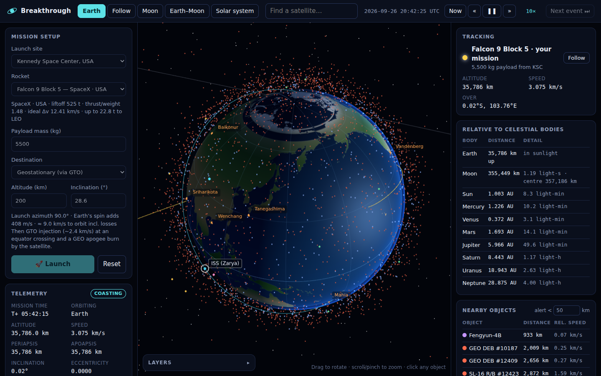

# breakthrough-1.0

**Breakthrough** is a browser-based space launch and orbit simulator. You can:

- **Simulate launches** of eight rockets (Falcon 9, Falcon Heavy, SLS Block 1, LVM3, PSLV-XL, Soyuz-2.1b, Saturn V, Electron) from eight real launch sites. Thrust, drag, mass flow and staging are integrated step by step, with live telemetry: altitude, speed, g-load, dynamic pressure, stage and propellant. Before launch, a flight-plan check runs the same model ahead of time. It tells you whether the rocket can reach the destination with your payload, and the heaviest payload it can carry there.
- **Follow travel paths**: the flown trail, the predicted orbit, a ground track, and multi-burn missions:
  - circular LEO / ISS / sun-synchronous / polar orbits,
  - GTO → geostationary (Hohmann transfer plus plane change),
  - trans-lunar injection (Lambert-targeted) → lunar orbit insertion,
  - **the planets**: Mercury, Venus, Mars, Jupiter, Saturn, Uranus and Neptune. The simulator finds the next launch window, then flies escape, cruise, trajectory correction and orbit insertion,
  - **moons of the planets**: Phobos, Deimos, Io, Europa, Ganymede, Callisto, Titan, Enceladus, Titania and Triton. After capture at the planet it transfers to the moon and enters orbit. Phobos and Deimos are too small to orbit, so those missions end in a rendezvous.
- **See where you are relative to celestial bodies**: altitude, lat/lon, sunlight or eclipse, and distances to the Moon, Sun, all eight planets and the moons around your destination (with light-time). There are Earth, Earth–Moon and Solar-system views, plus a close-up of any planet or moon. The camera switches to the solar-system view for the cruise and back again on arrival.
- **Share the sky with other objects**: 1,100+ satellites (stations, GNSS, GEO, Earth observation, science, Starlink/OneWeb/Iridium) and up to 20,000 debris objects, with nearest-object tracking and conjunction alerts.



## Run it

It is a static site with no build step and no npm install. Browsers block JavaScript modules on `file://` pages, so serve the folder with any static web server:

```bash
python3 -m http.server 8000      # or: npm start
# then open http://localhost:8000
```

To deploy, push the folder to any static host (GitHub Pages, Netlify, Vercel, S3). three.js is included in `vendor/`, so the site works offline and needs no CDN.

### Controls

| Action | How |
| --- | --- |
| Rotate / zoom | drag / scroll wheel or pinch |
| Select an object | click it, or use the search box |
| Pause / resume | **Space** or ❚❚ |
| Time warp | **+** / **−** or « » (capped at 50× during powered flight) |
| Skip a long coast | **N** or *Next event ⏭* |

### Preset missions via URL

`simulator.html` accepts `vehicle`, `site`, `target`, `payload`, `alt`, `inc` and `time`, for example:

```
simulator.html?vehicle=saturnv&site=ksc&target=moon&payload=45000
simulator.html?vehicle=pslv&site=shar&target=sso&payload=1750&time=2026-12-01T06:00:00Z
```

- Vehicle ids: `falcon9 lvm3 pslv soyuz saturnv electron`
- Site ids: `ksc vafb shar baikonur kourou wenchang tanegashima mahia`
- Target ids: `leo iss sso polar geo moon`, the planets `mercury venus mars jupiter saturn uranus neptune`, and the moons `phobos deimos io europa ganymede callisto titan enceladus titania triton`
- Planets and moons wait for the next launch window: pressing Launch jumps the clock ahead to it.

## Project structure

```
index.html              landing page
simulator.html          the simulator
css/                    base tokens, landing page and simulator styles
js/core/                physics (no DOM, runs in Node too)
  constants.js            physical constants
  time.js                 Julian date, sidereal time, ECI <-> lat/lon
  ephemeris.js            Sun, Moon and planet positions
  orbits.js               Kepler & universal-variable propagation, elements
  bodies.js               Sun, planets and moons: masses, radii, poles, positions
  lambert.js              Lambert solver (lunar, interplanetary and moon transfers)
  interplanetary.js       launch-window search, escape geometry, capture orbits
  ascent.js               powered-ascent simulation and guidance
  mission.js              mission timeline, burns, patched conics
  planner.js              pre-launch check: can this rocket reach the destination?
  population.js           batch propagation of catalogue objects
js/data/                vehicles, launch sites, satellite catalogue, debris, coastlines
js/view/                three.js scenes, labels, ground-track map, textures
js/main.js              simulator app (UI wiring and render loop)
js/hero.js              landing-page animation
tests/                  physics tests (node --test)
vendor/three/           three.js r170 (MIT)
```

## How the physics works

- **Ascent**: integrated in 3D (RK4 at 0.1 s) from the pad, moving with Earth's rotation. It covers gravity, altitude-dependent thrust and Isp, drag in a co-rotating exponential atmosphere, throttling to a 4.5 g limit, and staging. Guidance: vertical rise → pitch kick along the launch azimuth → gravity turn → closed-loop steering above 40 km. The closed-loop phase solves for a linear radial-acceleration profile that reaches the insertion radius with zero vertical speed. It also yaws the thrust to remove velocity across the target plane: for an inclination target, the heading that gives that inclination at the current latitude; for a specific plane (Moon, planets), both the sideways offset and the sideways velocity.
- **Range safety and doglegs**: every launch site has corridors of allowed launch azimuths (`js/data/sites.js`), so spent stages and failures fall into the sea. If an orbit's natural azimuth is forbidden, there are two cases.
  - Orbits whose inclination matters (SSO, polar, ISS, custom LEO) launch along the corridor edge, then make a *dogleg* turn during the upper-stage burns. Example: PSLV from Sriharikota flies 140° over the Bay of Bengal. After 150 km it turns towards 188°, so its ground track and impact point pass east of Sri Lanka. The turn costs payload: about 1,100 kg to 600 km SSO here, against the real 1,750 kg. ISRO's optimised guidance flies it more efficiently than this model.
  - Transfer parking orbits (GEO, Moon, planets) simply take the nearest allowed azimuth. From Sriharikota, GTO launches go east-south-east into a ~17° orbit rather than due east. Targets above 250 km are reached with a 200 km-perigee transfer ellipse and a circularisation burn at apogee.
- **Coasting**: exact two-body conics (universal-variable propagation), so any time warp is error-free. Burns are impulsive.
- **GEO**: GTO injection at an equator crossing, then an apogee burn that circularises and removes the inclination.
- **Planets**: a launch-window search over the next synodic period solves Lambert's problem around the Sun for each departure date and flight time. It minimises escape plus capture delta-v, with a small penalty per year of cruise. Run for 2020, it finds Perseverance's window: 27 Jul 2020 → 17 Feb 2021, C3 14 km²/s². The parking orbit contains the escape direction, and the escape burn happens where the hyperbola's asymptote lines up. Leaving Earth's sphere of influence switches to a Sun-centred orbit (patched conics), where a trajectory correction re-targets the planet. On arrival the approach is trimmed into the planet's equatorial plane, then a capture burn enters an elliptical orbit.
- **Moons of planets**: from the capture orbit, a second Lambert search picks the cheapest transfer to the moon, aimed at the flyby distance that puts periapsis at the target altitude. Orbit insertion follows (or a rendezvous for Phobos and Deimos).
- **Moon**: the parking orbit is aligned with the Moon's expected position. The code scans the next 1.5 orbits and several flight times for the cheapest Lambert arc. At the Moon's sphere of influence it switches to Moon-centred motion, trims the approach for a 100 km periselene, and brakes into a circular lunar orbit.
- **Satellites and debris**: Keplerian orbits with J2 secular drift of the node and perigee, so sun-synchronous orbits stay sun-synchronous.
- **Ephemerides**: Astronomical Almanac low-precision Sun and Moon series, and JPL's approximate Keplerian elements for the planets (1800–2050).

Typical results match real missions: Falcon 9 GTO injection ≈ 2.45 km/s, GEO apogee burn ≈ 1.84 km/s, Saturn V TLI ≈ 3.1–3.2 km/s, LOI ≈ 0.8 km/s, Mars orbit insertion ≈ 0.9 km/s, and Jupiter orbit insertion ≈ 0.5 km/s (Juno's was 0.54 km/s). Missions to the moons of the giant planets fly direct, without the gravity-assist tours real missions use, so their moon-transfer burns are larger than real missions need.

## Accuracy and data

This is an educational tool, not an operational one.

- Vehicle figures approximate published data.
- Satellites use representative orbits: correct altitude, inclination and shape, and real longitudes for GEO spacecraft, but not live TLE data.
- Debris is synthetic, matching the real population's altitude and inclination structure (Fengyun-1C, Iridium–Cosmos and Cosmos 1408 clouds, GTO rocket bodies, the GEO belt).
- Moons of other planets move on circular orbits in their planet's equatorial plane with the correct radius and period, but their position along the orbit is representative. Planet and moon surfaces are procedurally generated.

## Tests

```bash
npm test   # Node 18+, no dependencies
```

The tests cover element conversions, propagation, Lambert targeting, sun-synchronous inclination, the ephemerides, GEO station-keeping, and end-to-end LEO, SSO, GEO and lunar missions (including an overloaded rocket that must fail).

## Credits

- [three.js](https://threejs.org) (MIT), vendored in `vendor/three/`.
- Coastlines from [Natural Earth](https://www.naturalearthdata.com) (public domain) via `world-atlas`.
